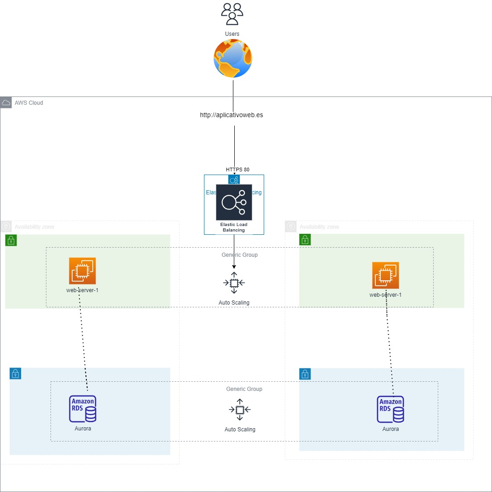

# Despliegue de un Servicio Web en Alta Disponibilidad con Terraform en AWS

Este repositorio contiene un flujo de trabajo básico para desplegar un entorno de un servicio web en alta disponibilidad en AWS utilizando Terraform y Makefile. La configuración está orientada a facilitar la gestión y despliegue de recursos, permitiendo ejecutar los comandos de Terraform de forma más sencilla.

## 🚀 Funcionalidades

- **Automatización con Makefile:** Comandos para inicializar, validar, planificar, aplicar y destruir recursos en AWS con Terraform.
- **Gestión de recursos en AWS:** Configuración para despliegue de redes, bases de datos, almacenamiento y más.
- **Reportes de costos:** Generación de reportes de costos con Infracost para visualizar el impacto financiero de la infraestructura antes de su implementación.

## 🖼️ Arquitectura del Proyecto

A continuación, se muestra un diagrama de la arquitectura del despliegue:



## 📋 Requisitos

- [Terraform](https://www.terraform.io/downloads.html) instalado.
- [AWS CLI](https://aws.amazon.com/cli/) configurado con perfiles de autenticación.
- [Make](https://www.gnu.org/software/make/) instalado.


## ⚙️ Uso

# Terraform Makefile - Caso de Uso

Este Makefile facilita la administración de infraestructura con Terraform mediante comandos simples y reutilizables.

## Configuración

Antes de ejecutar los comandos, asegúrate de actualizar las variables de entorno en Terraform Cloud: 
AWS_ACCESS_KEY_ID
AWS_SECRET_ACCESS_KEY
AWS_SESSION_TOKEN


## Comandos Disponibles

### Inicialización y validación:
```sh
make tf-init
```

### Planificación:
```sh
make tf-plan
```

### Aplicación del plan:
```sh
make tf-apply
```

### Destrucción de recursos:
```sh
make tf-destroy
```

### Visualización de salidas:
```sh
make tf-output
```

Este Makefile optimiza el flujo de trabajo de Terraform, asegurando consistencia en cada ejecución.

# Despliegue de Infraestructura en AWS con Terraform


## Estructura del Proyecto
├── main.tf # Archivo principal que invoca a los módulos
├── provider.tf # Archivo que define en qué región invocamos los datos y añadimos el required de terraform con aws
├── variables.tf # Variables que define la región
├── outputs.tf # Outputs de todos los modulos
├── modules/ │ 
    ├── vpc/ 
       ├── main.tf # Recursos para crear la VPC, las subnets, el IGW, el NATGW, las route tables y el grupo de subnets. 
       ├── variables.tf # Variables para los recursos VPC 
       └── outputs.tf # Outputs de los recursos VPC 
    ├── sg
       ├── main.tf # Recursos para la crear de dos SG 
       ├── variables.tf # Variables para los SGs 
       └── outputs.tf # Outputs de los SGs
    │── ec2/  
        ├── main.tf # Recursos para la creación de dos instancias EC2 
        ├── variables.tf # Variables para la creación de las instancias
        └── outputs.tf # Outputs de las instancias. 
    │── bucket/  
        ├── main.tf # Recursos para crear el Bucket S3 
        ├── variables.tf # Variables para el Bucket S3 
        └── outputs.tf # Outputs del Bucket 
    │── alb/  
        ├── main.tf # Recursos para crear el ALB 
        ├── variables.tf # Variables para el ALB 
        └── outputs.tf # Outputs del ALB
    │── RDS/  
        ├── main.tf # Recursos para crear RDS 
        ├── variables.tf # Variables para RDS 
        └── outputs.tf # Outputs del RDS 
└── README.md # Este archivo

## Descripción de los Módulos

### 1. Módulo VPC

- **Objetivo**: Crear la VPC, las subnets, el IGW, el NATGW, las route tables y el grupo de subnets.
- **Recursos Incluidos**:
  - Una VPC con un bloque CIDR definido.
  - Cuatro subnets asociada a la VPC.
  - Un Internet Gateway.
  - Un Nat Gateway.
  - Un Grupo de Subnets
  - Dos tablas de rutas con sus asignaciones.
- **Uso**: Provee las conexiones necesarias para el despliegue y comunicacion de los servicios desplegados.

### 2. Módulo SG

- **Objetivo**: Crear dos SG.
- **Recursos Incluidos**:
  - Un SG que permite únicamente los puertos 443, 80 y 22 a los webserver de las EC2 como puertos de entrada y todos los puertos de salida.
  - Un SG que permite únicamente el puerto de entrada 3306 y todos los puertos de salida.
- **Uso**: Provee los grupos de seguridad necesarios para securizar el acceso a la EC2.


### 3. Módulo EC2

- **Objetivo**: Crear dos instancias EC2 una en cada zona de disponibilidad.
- **Configuración**: Permite especificar el nombre, la ami y el tipo de instancia.
- **Outputs**: Se generan outputs con informaciones sobre las EC2

### 4. Módulo S3

- **Objetivo**: Crear un Bucket S3.
- **Configuración**: Permite especificar el nombre del bucket a través de una variable.
- **Outputs**: Se generan outputs con información del Bucket S3

### 5. Módulo ALB

- **Objetivo**: Crear un ALB con su target group y su listener.
- **Configuración**: Se exportan las variables para su uso en el mailPermite especificar el nombre del bucket a través de una variable.
- **Outputs**: Se generan outputs con información del Bucket ALB


### 6. Módulo RDS

- **Objetivo**: Crear una instancia RDS de Base de datos en configuración Multiaz. Se configura también un cluster RDS para ofrecer y analizar ambas soluciones.
- **Configuración**: Se exportan las variables para su uso en el mailPermite especificar el nombre del bucket a través de una variable.
- **Outputs**: Se generan outputs con información del Bucket ALB


